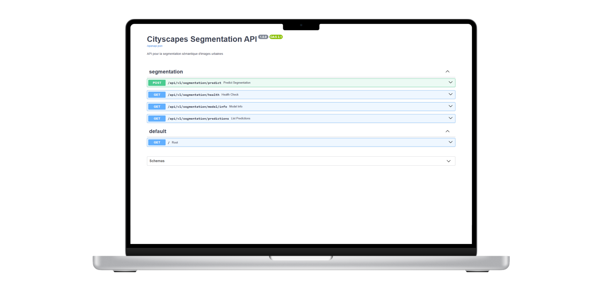
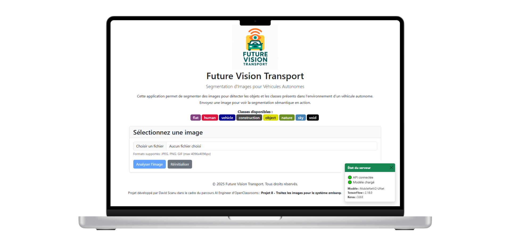
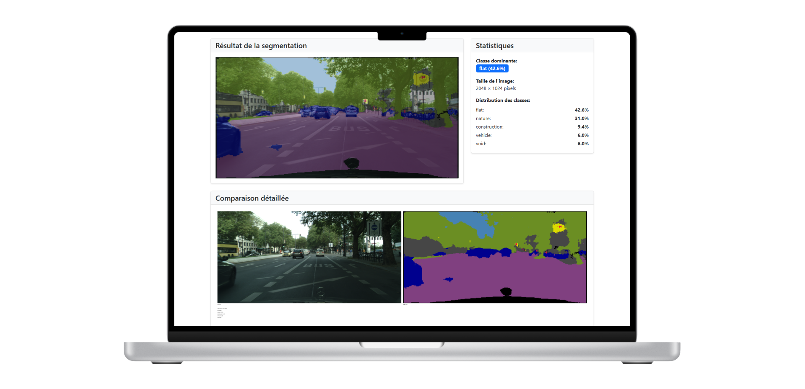

# Projet 8 : Traitement d'images pour le système embarqué d'une voiture autonome


> 🎓 OpenClassrooms • Parcours [AI Engineer](https://openclassrooms.com/fr/paths/795-ai-engineer) | 👋 *Étudiant* : [David Scanu](https://www.linkedin.com/in/davidscanu14/)

## 🌐 Contexte

Ce projet s'inscrit dans le développement d'un **système embarqué de vision par ordinateur** pour véhicules autonomes chez **Future Vision Transport**. L'entreprise conçoit des systèmes permettant aux véhicules autonomes de percevoir leur environnement grâce à l'analyse d'images en temps réel.

## ⚡ Mission

En tant qu'ingénieur IA dans l'équipe R&D, notre mission est de **développer le module de segmentation d'images** (composant 3) qui s'intègre entre le module de traitement d'images (2) et le système de décision (4). Ce module doit être capable d'**identifier et de segmenter précisément 8 catégories principales d'objets** dans des images de caméras embarquées utilisant le dataset Cityscapes.

### 🏗️ Architecture du Système Embarqué
```
[1] Acquisition → [2] Traitement → [3] SEGMENTATION → [4] Décision
   d'images      d'images         (Notre rôle)      finale
```

## 🎯 Objectifs Techniques

- **Modèle IA** : Développer un modèle de segmentation sémantique MobileNetV2-UNet avec Keras/TensorFlow
- **API Production** : Concevoir et déployer une API REST avec FastAPI sur Railway
- **Interface Demo** : Créer une application web de visualisation avec Next.js sur Vercel
- **Pipeline MLOps** : Mettre en place un suivi d'expériences avec MLflow
- **Documentation** : Produire un rapport technique et une présentation professionnelle

## 🗓️ Méthodologie

### 1. **Exploration et Préparation des Données**
- Analyse du dataset **Cityscapes** (5000 images annotées, 50 villes européennes)
- **Regroupement de 30+ classes** en 8 catégories pertinentes pour la navigation
- **Pipeline de préprocessing** : Redimensionnement 2048×1024 → 224×224
- **Augmentation de données** : Flip horizontal, variations de luminosité

### 2. **Développement du Modèle**
- **Architecture hybride** : MobileNetV2 (encodeur) + U-Net (décodeur)
- **Transfer learning** : Encodeur pré-entraîné sur ImageNet (gelé)
- **Entraînement** : 18 époques, callbacks optimisés (EarlyStopping, ReduceLROnPlateau)
- **Suivi MLflow** : Versioning et traçabilité des expériences

### 3. **Déploiement et Interface**
- **API FastAPI** : Endpoints de prédiction avec génération d'artefacts visuels
- **Frontend Next.js** : Interface intuitive d'upload et visualisation
- **Architecture cloud** : Railway (backend) + Vercel (frontend)

### 4. **Évaluation et Optimisation**
- **Métriques** : Mean IoU, Précision pixel-wise, Analyse par classe
- **Validation rigoureuse** : Train/Val/Test split avec prévention du data leakage

## 🏗️ Architecture du Projet

```
oc-ai-engineer-p08-images-systeme-voiture-autonome/
├── app/
│   ├── backend/                 # API FastAPI
│   │   ├── main.py             # Point d'entrée FastAPI
│   │   ├── config.py           # Configuration et variables
│   │   ├── models/
│   │   │   └── predictor.py    # Logique de prédiction
│   │   ├── routers/
│   │   │   └── segmentation.py # Endpoints API
│   │   ├── schemas/
│   │   │   └── prediction.py   # Modèles Pydantic
│   │   ├── utils/
│   │   │   └── image_processing.py
│   │   └── requirements.txt
│   └── frontend/               # Application Next.js
│       ├── components/         # Composants React
│       ├── pages/             # Pages de l'application
│       ├── public/            # Ressources statiques
│       ├── package.json
│       └── next.config.js
├── notebooks/                  # Développement du modèle
│   └── p08_david_scanu_notebook_MobileNetV2_UNet.ipynb.ipynb
├── docs/                      # Documentation
│   ├── p08_david_scanu_rapport_technique.pdf
│   └── p08_david_scanu_presentation.pdf
├── app/backend/railway.json   # Config déploiement Railway
└── README.md
```

## 🔧 Technologies Utilisées

### **Deep Learning & Data Science**
- **TensorFlow 2.18** / **Keras 3.x** : Développement du modèle MobileNetV2-UNet
- **MLflow** : Gestion des expériences et versioning des modèles
- **NumPy**, **Pandas** : Manipulation de données
- **Pillow**, **OpenCV** : Traitement d'images

### **Backend & API**
- **FastAPI** : Framework web asynchrone pour l'API REST
- **Uvicorn** / **Gunicorn** : Serveurs ASGI pour la production
- **Pydantic** : Validation et sérialisation des données

### **Frontend & Interface**
- **Next.js 15.3** : Framework React pour l'interface utilisateur
- **Bootstrap 5.3** : Framework CSS responsive
- **Fetch API** : Communication avec l'API backend

### **Déploiement & Infrastructure**
- **Railway** : Déploiement cloud de l'API FastAPI
- **Vercel** : Déploiement de l'application Next.js
- **AWS S3** : Stockage des artefacts MLflow

## 🏗️ Architecture du modèle de segmentation d'images urbaines

### 🔗 Architecture Hybride en Forme de U

Notre modèle combine la puissance de **MobileNetV2** (encodeur) avec la structure **U-Net** (décodeur) pour une segmentation sémantique optimisée embarquée.


### 🔽 **Encodeur : MobileNetV2 (Gelé)**
- **Backbone pré-entraîné** sur ImageNet pour transfer learning efficace
- **Extraction multi-échelle** à 4 niveaux de résolution :
  - 112×112 → 56×56 → 28×28 → 14×14 → **Bottleneck 7×7**
- **Optimisé mobile** : Depthwise separable convolutions pour efficacité

### 🔼 **Décodeur : Structure U-Net**
- **Reconstruction progressive** via convolutions transposées
- **Skip connections** : Préservation des détails spatiaux fins
- **Pipeline par niveau** : Conv2DTranspose → BatchNorm → ReLU → Concatenate

### ⚡ **Spécifications Techniques**
- **Entrée** : Images 224×224×3 (redimensionnées depuis 2048×1024)
- **Sortie** : Masque de segmentation 224×224×8 classes
- **Paramètres** : 5.4M total (3.6M entraînables, 1.8M gelés)
- **Activation finale** : Softmax pour classification multi-classe

### 🎯 **Avantages de cette Architecture**
- **Efficacité embarquée** : Conçu pour ressources limitées
- **Transfer learning robuste** : Convergence rapide et stable
- **Préservation des détails** : Skip connections critiques pour segmentation précise
- **Performance temps réel** : Compatible contraintes véhicule autonome

## 📊 Performances du modèle

### 🎯 **Résultats Globaux**
- **Mean IoU** : **63.25%**
- **Précision pixel-wise** : **87.95%**
- **Convergence** : 18 époques (~2h d'entraînement)
- **Paramètres** : 5.4M (3.6M entraînables)

### 🏆 **Performance par catégorie (IoU)**
| Catégorie | IoU | Importance Navigation |
|-----------|-----|----------------------|
| 🛣️ **flat** | **90.8%** | 🔴 Critique |
| ☁️ **sky** | **83.4%** | 🟢 Contextuel |
| 🌳 **nature** | **79.8%** | 🟢 Contextuel |
| 🚗 **vehicle** | **74.7%** | 🔴 Critique |
| 🏢 **construction** | **74.5%** | 🟡 Important |
| ⚫ **void** | **64.3%** | ⚫ Technique |
| 👤 **human** | **32.0%** | 🔴 Critique |
| 🚦 **object** | **6.5%** | 🟡 Important |

### ✅ **Points forts**
- **Excellence** sur les surfaces planes et structures dominantes
- **Performance temps réel** compatible avec les contraintes embarquées
- **Architecture optimisée** pour les ressources limitées

### ⚠️ **Axes d'amélioration**
- **Détection des objets fins** (panneaux, poteaux) à améliorer
- **Segmentation des humains** variable selon le contexte
- **Entraînement progressif** avec dégelage de l'encodeur envisageable

## 🚀 Installation en local

### **Prérequis**
- Python 3.10+
- Node.js 16+
- Compte MLflow avec accès S3

### **Backend API FastAPI**

L'API FastAPI permet de soumettre des images pour prédiction et de récupérer les résultats de segmentation. Elle est conçue pour être performante et scalable, avec une documentation interactive intégrée.



Pour lancer l'API FastAPI, suivez ces étapes :

```bash
# Cloner le dépôt
git clone https://github.com/DavidScanu/oc-ai-engineer-p08-images-systeme-voiture-autonome.git
cd oc-ai-engineer-p08-images-systeme-voiture-autonome/app/backend

# Créer un environnement virtuel
python -m venv venv
source venv/bin/activate  # Windows: venv\Scripts\activate

# Installer les dépendances
pip install -r requirements.txt

# Configurer les variables d'environnement
export MLFLOW_TRACKING_URI="your-mlflow-uri"
export AWS_ACCESS_KEY_ID="your-access-key"
export AWS_SECRET_ACCESS_KEY="your-secret-key"
export RUN_ID="your-experiment-run-id"
export FRONTEND_URL=http://localhost:3000
export PORT=8000

# Lancer l'API
uvicorn main:app --reload --host 0.0.0.0 --port 8000
```

### **Frontend Next.js**

L'interface utilisateur Next.js permet de télécharger des images et de visualiser les résultats de segmentation en temps réel. Elle offre une expérience utilisateur fluide et intuitive, avec un design responsive.

#### Aperçu de l'interface utilisateur :

Avant d'envoyer une image, l'interface affiche un message d'accueil et un bouton pour télécharger une image :



Après avoir téléchargé une image, l'interface affiche la segmentation réalisée par le modèle :




Pour lancer l'interface utilisateur, suivez ces étapes :

```bash
cd ../frontend

# Installer les dépendances
npm install

# Configurer l'URL de l'API
export NEXT_PUBLIC_API_URL="http://localhost:8000"

# Lancer en développement
npm run dev
```

## 📋 Livrables

### **Développement & Code**
- **Code complet** : [GitHub Repository](https://github.com/DavidScanu/oc-ai-engineer-p08-images-systeme-voiture-autonome)
- **Notebook de développement** : [Google Colab](https://colab.research.google.com/drive/1jZ2tdEyJ2xaERUCwyQ5juwPJrEyIAtBN?usp=sharing)

### **Applications Déployées**
- **API FastAPI de production** : Déployée sur Railway (URL non-protégée disponible sur demande)
- **Interface Next.js** : Déployée sur Vercel (URL non-protégée disponible sur demande)

### **Documentation**
- **Rapport technique** : [Google Docs](https://docs.google.com/document/d/1ACjrsOGwafw-D72CgmbF6DkU7bktG7OnPxmPL99inCU/edit?usp=sharing)
- **Article technique complet** : [dev.to](https://dev.to/davidscanu/segmentation-dimages-pour-pour-le-systeme-embarque-dune-voiture-autonome-2f5e/)
- **Support de présentation** : [Google Slides](https://docs.google.com/presentation/d/10sbXJKSd5XwDln6k0y3O-i1Ev7iUPg58iz36Pi6NGkk/edit?usp=sharing)


## 🔮 Perspectives d'évolution

### **Améliorations Modèle**
- **Entraînement progressif** : Dégelage de l'encodeur en phase 2
- **Augmentation avancée** : Simulation météorologique (pluie, brouillard)
- **Architecture multi-échelles** : Amélioration de la robustesse

### **Optimisations système**
- **Authentification API** : Sécurisation des endpoints
- **Cache intelligent** : Optimisation des temps de réponse
- **Monitoring avancé** : Métriques de performance en production

### **Intégration industrielle**
- **Fusion multi-sensorielle** : Combinaison avec radar/lidar
- **Optimisation embarquée** : Quantization et pruning
- **Pipeline temps réel** : Traitement vidéo en continu

---

## 👋 À Propos

**Projet développé par [David Scanu](https://www.linkedin.com/in/davidscanu14/)** dans le cadre du parcours [AI Engineer](https://openclassrooms.com/fr/paths/795-ai-engineer) d'OpenClassrooms.